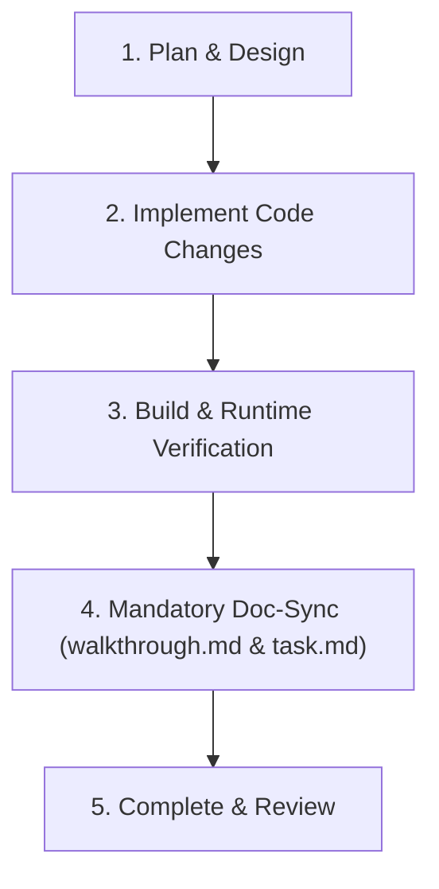

# Development Workflow & Documentation Guidelines

This document outlines the standard development workflow for **fx-vault**, ensuring that all changes are properly planned, tested, verified, and documented.

---

## Mandatory Documentation Sync Policy ("Doc-Sync Rule")

> [!IMPORTANT]
> **Rule**: For **EVERY major feature, architectural shift, model/schema modification, or sync logic update**, the project documentation in [`docs/`](file:///home/jirehpadua/fx-vault/docs) MUST be updated accordingly.

### Which files to update:
1. **[`docs/walkthrough.md`](file:///home/jirehpadua/fx-vault/docs/walkthrough.md)**:
   - Add a new numbered section for the feature/change.
   - Explain the technical rationale, files modified, data flows, and API/model updates.
   - Link directly to modified source files.

2. **[`docs/task.md`](file:///home/jirehpadua/fx-vault/docs/task.md)**:
   - Add checklist items corresponding to the new feature or refactor steps.
   - Mark items `[x]` as they are completed and verified.

3. **[`docs/ai_learnings.md`](file:///home/jirehpadua/fx-vault/docs/ai_learnings.md)**:
   - Mandatory log whenever a command error, build failure, bug, or logic mistake occurs.
   - Documents the **Issue**, **Root Cause**, and **Resolution / Rule** so the AI never repeats the same mistake.

4. **[`docs/implementation_plan.md`](file:///home/jirehpadua/fx-vault/docs/implementation_plan.md)**:
   - Use before starting a complex task to map out proposed code modifications, user review items, and verification strategies.

---

## Standard Development Cycle

### Step 1: Planning
- Define requirements, model updates, and UI changes.
- Outline steps in [`docs/implementation_plan.md`](file:///home/jirehpadua/fx-vault/docs/implementation_plan.md) if non-trivial.

### Step 2: Implementation
- Maintain clean code separation across `core/` (models, database, store, sync, content) and `features/`.
- Enforce touch-friendly `min-h-[48px]` interactive controls and Tailwind styling.

### Step 3: Empirical Verification
- Run `npm run build` or `npx nx build fx-vault` to verify type-checking and bundling.
- Validate dev server output on `http://localhost:3000`.

### Step 4: Documentation Update
- Append new section to [`docs/walkthrough.md`](file:///home/jirehpadua/fx-vault/docs/walkthrough.md).
- Update task tracking in [`docs/task.md`](file:///home/jirehpadua/fx-vault/docs/task.md).
